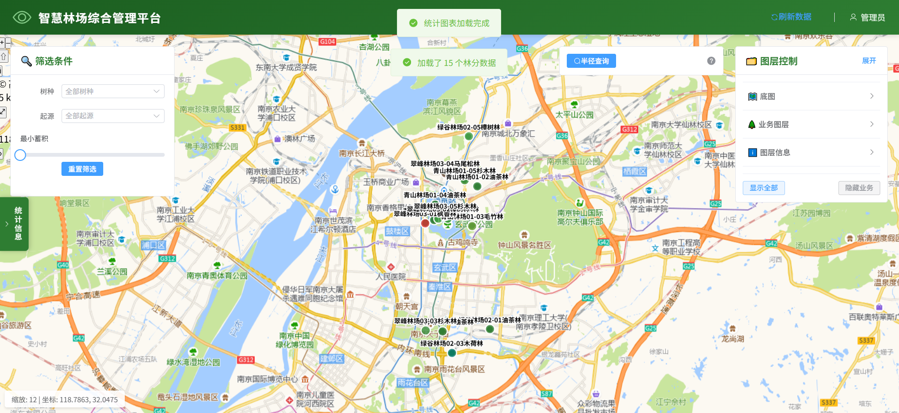
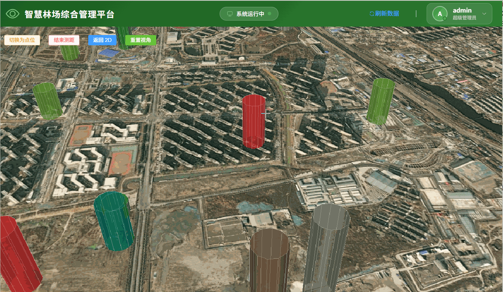
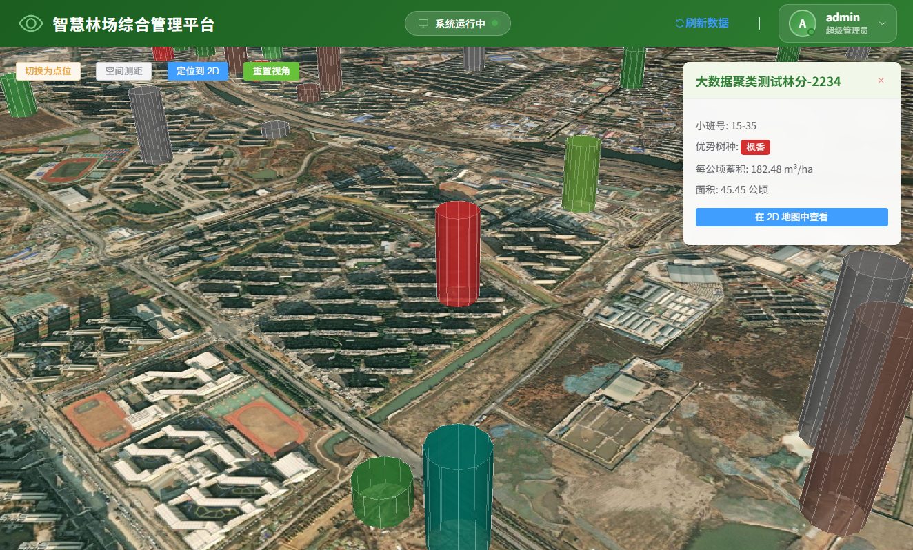

# 智慧林场综合管理平台 🌲

[](https://vuejs.org/)
[](https://openlayers.org/)
[](https://cesium.com/)
[](https://spring.io/)
[](http://geoserver.org/)
[](LICENSE)

> 基于 WebGIS 技术的林业资源可视化管理系统，实现林场数据的空间展示、2D/3D 多维查询分析与统计可视化，支持全端跨设备访问。

---

## 📋 项目简介

本项目是一个面向林业管理的综合GIS平台，采用前后端分离架构，集成了 2D/3D 地图可视化、空间查询、数据统计分析等核心功能。系统不仅支持 PC 端的复杂交互分析，还针对移动端进行了深度适配；同时创新性地引入了三维地球引擎，实现林地数据的立体化展示与空间量算。

## 📸 功能展示

### 主界面

*智慧林场综合管理平台主界面，左侧统计面板，右侧地图展示*

### 🎬 最新演示 (3D地图)

### 🌐 三维场景与空间分析

*基于 Cesium 的三维地球引擎，蓄积量数据 3D 柱状图建模展示*

### 🗺️ 3D 空间查询与交互

*支持空间测距*

### 核心功能

| 功能模块             | 描述                                        |
|------------------|-------------------------------------------|
| 🗺️ **2D 地图可视化** | 基于 OpenLayers 的林场小班空间数据展示，支持 WMS/WFS 服务   |
| 🌐 **三维场景展示**    | 基于 Cesium 的三维地球立体展示，林地蓄积量 3D 柱状图建模，空间距离测量 |
| 📱 **移动端深度适配**   | 响应式布局重构，移动端触摸优化，独立详情页跳转体验                 |
| 🔍 **空间查询**      | 2D/3D 半径范围查询、点击查询、属性筛选、悬停高亮               |
| 📊 **统计分析**      | 树种分布图、蓄积量趋势图、生长趋势分析                       |
| 🎛️ **图层控制**     | 多图层叠加、透明度调节、2D/3D 视角无缝切换                  |
| 📋 **详情展示**      | 林场小班详情卡片、样地数据展示、2D/3D 联动定位                |

---

### 交互演示

*半径查询、图层切换、详情展示等核心功能演示*

### 特色功能截图

**三维蓄积量可视化**

*Cesium 三维引擎下，以 3D 圆柱体高度直观映射每公顷蓄积量，支持动态光影与视角旋转*
## 🏗️ 技术架构

### 前端技术栈
```
Vue 3.2 + Composition API
├── OpenLayers 10.8    # GIS 地图引擎
├── Element Plus 2.3   # UI 组件库
├── Chart.js 3.9       # 数据可视化图表
├── Cesium 1.14        # 3D 地球与三维场景引擎
└── Vite 7.3           # 极速构建工具
```


### 后端技术栈
```
Spring Boot 4.0.3
├── Spring Security + JWT（jjwt 0.12.6） # 无状态认证与授权
├── MyBatis-Plus 3.5.15 # ORM 与 CRUD 增强
├── PostgreSQL17 + PostGIS3.4 # 空间数据库与空间查询
├── GeoTools 29.0 + JTS 1.19.0 # 空间数据处理与几何运算
├── GeoServer（2.26+） # WMS/WFS 地图服务
└── Gradle # 构建工具
```

### 系统架构图
```
┌───────────────────────────────────────────────────────────────────┐
│ 前端层 (Vue 3)                                                     │
│ ┌───────────────────┐ ┌───────────────────┐ ┌───────────────────┐ │
│ │ Map View          │ │ Cesium View       │ │ Layer Control     │ │
│ │ (OpenLayers)      │ │ (3D Engine)       │ │ (Element Plus)    │ │
│ └───────────────────┘ └───────────────────┘ └───────────────────┘ │
└───────────────────────────────────────────────────────────────────┘
                               │
                        ┌──────┴──────┐
                        │   REST API  │
                        └──────┬──────┘
                               │
┌───────────────────────────────────────────────────────────────────┐
│ 后端层 (Spring Boot 4.0.3)                                         │
│ ┌───────────────────┐ ┌───────────────────┐ ┌───────────────────┐ │
│ │ Controller        │ │ Service           │ │ Repository        │ │
│ │ (REST API)        │ │ (Business Logic)  │ │ (MyBatis-Plus)    │ │
│ └───────────────────┘ └───────────────────┘ └───────────────────┘ │
└───────────────────────────────────────────────────────────────────┘
                               │
┌───────────────────────────────────────────────────────────────────┐
│ 数据层                                                             │
│ ┌───────────────────┐ ┌───────────────────┐ ┌───────────────────┐ │
│ │ PostgreSQL        │ │ PostGIS           │ │ GeoServer         │ │
│ │ (属性数据)         │ │ (空间数据)        │ │ (WMS/WFS服务)      │ │
│ └───────────────────┘ └───────────────────┘ └───────────────────┘ │
└───────────────────────────────────────────────────────────────────┘
```

## 📁 项目结构
前端：
```
frontend/forest_front/              # 前端项目根目录
├── index.html                      # Vite 入口 HTML
├── package.json                    # 依赖管理
├── vite.config.js                  # Vite 配置 (含 Cesium 插件)
├── .eslintrc.js                    # ESLint 代码规范
├── .gitignore
└── src/                            # 源代码目录
    ├── App.vue                     # 根组件
    ├── main.js                     # 应用入口
    ├── api/                        # 🌐 API 接口层
    │   ├── auth.js                 # 认证接口 (登录/注册)
    │   ├── forest.js               # 林业业务接口 (小班/样地)
    │   └── request.js              # Axios 统一请求封装与拦截
    ├── assets/                     # 🎨 静态资源
    │   └── logo.png
    ├── components/                 # 🧩 组件目录
    │   ├── cesium/                 # 三维场景组件
    │   │   └── CesiumMap.vue       # 3D 视图 (蓄积量3D柱、空间测距)
    │   ├── charts/                 # 📊 图表组件
    │   │   ├── ChartContainer.vue  # 图表容器布局
    │   │   ├── MobileStatsPanel.vue# 移动端专属统计面板
    │   │   ├── SpeciesChart.vue    # 树种分布饼图
    │   │   ├── TrendChart.vue      # 蓄积量趋势折线图
    │   │   └── VolumeChart.vue     # 蓄积量柱状图
    │   ├── common/                 # ⚙️ 通用基础组件
    │   │   ├── LoadingMask.vue     # 全局加载遮罩
    │   │   └── StatsCard.vue       # 数据统计卡片
    │   ├── map/                    # 🗺️ 2D 地图组件
    │   │   ├── LayerControl.vue    # 图层控制器
    │   │   ├── MapContainer.vue    # 2D 地图容器 (集成移动端适配)
    │   │   ├── MapPopup.vue        # 桌面端属性弹窗
    │   │   └── RadiusQuery.vue     # 半径空间查询
    │   ├── stand/                  # 🌲 林分管理组件
    │   │   └── StandEditDrawer.vue # 林分数据编辑抽屉
    │   └── HelloWorld.vue          # (脚手架初始模板，可清理)
    ├── composables/                # 🪝 组合式函数
    │   ├── useAutoRefresh.js       # 数据自动刷新逻辑
    │   ├── useCharts.js            # Chart.js 图表初始化与更新
    │   ├── useLayers.js            # 图层动态控制逻辑
    │   ├── useMap.js               # OpenLayers 核心地图逻辑
    │   ├── useMobile.js            # 移动端终端检测与交互适配
    │   ├── usePopup.js             # 弹窗状态管理
    │   └── useStats.js             # 统计数据计算逻辑
    ├── config/                     # ⚙️ 全局配置
    │   └── index.js                # 常量配置 (如树种颜色映射 SPECIES_COLORS)
    ├── directives/                 # 🎯 自定义指令
    │   └── permission.js           # 🆕 按钮级权限校验指令 (v-permission)
    ├── router/                     # 🚦 路由配置
    │   └── index.js                # 路由表与导航守卫
    ├── stores/                     # 🍍 状态管理
    │   └── user.js                 # 用户状态管理 (Token/用户信息)
    ├── styles/                     # 👗 全局样式
    │   └── variables.scss          # SCSS 全局变量
    ├── utils/                      # 🛠️ 工具函数库
    │   ├── auth.js                 # Token 读写与清除
    │   ├── calculations.js         # 面积/蓄积量等业务计算
    │   ├── export.js               # Excel/CSV 导出封装
    │   └── formatters.js           # 日期/数字格式化
    └── views/                      # 📄 页面视图
        ├── 3DMapView.vue           # 🆕 三维场景全屏页面
        ├── AdminView.vue           # 后台管理主页
        ├── DashboardLayout.vue     # 仪表盘整体布局框架
        ├── DashboardView.vue       # 首页数据看板 (2D地图+图表)
        ├── HomeView.vue            # 引导页/落地页
        ├── LoginView.vue           # 用户登录页
        ├── RegisterView.vue        # 用户注册页
        ├── ProfileView.vue         # 个人中心页
        ├── NotFoundView.vue        # 404 无效路由页
        └── StandDetailView.vue     # 移动端林分详情独立页

```
后端：
```
src/main/java/com/ceshi/forest/         # 后端项目根目录
├── ForestGisApplication.java           # Spring Boot 启动类
├── PasswordTest.java                   # (测试类，打包时可忽略)
│
├── aspect/                             # 🧩 AOP 切面编程
│   ├── ControllerLogAspect.java        # Controller 层请求日志记录
│   ├── ServiceLogAspect.java           # Service 层耗时与异常日志
│   └── NoLog.java                      # 自定义注解：排除特定方法日志
│
├── config/                             # ⚙️ 核心配置类
│   ├── CacheConfig.java                # Caffeine 本地缓存装配
│   ├── GeoserverConfig.java            # GeoServer 服务地址配置
│   ├── PostGISGeometryTypeHandler.java # MyBatis PostGIS 几何对象类型转换器
│   ├── RedisConfig.java                # Redis 序列化与模板配置
│   ├── SecurityConfig.java             # Spring Security 过滤链与跨域配置
│   └── WebMvcConfig.java               # 拦截器与静态资源映射
│
├── controller/                         # 🎯 控制器层 (REST API)
│   ├── AuthController.java             # 认证接口 (登录/注册/获取信息)
│   ├── ForestStandController.java      # 林场小班接口 (CRUD/筛选/导出)
│   ├── GeoserverProxyController.java   # GeoServer 代理转发接口 (解决跨域)
│   ├── SamplePlotController.java       # 样地数据接口
│   └── TreeMeasurementController.java  # 测树数据接口
│
├── dto/                                # 📦 数据传输对象 (隔离实体与前端)
│   ├── auth/                           # 认证模块专属 DTO
│   │   ├── LoginRequest.java           # 登录请求参数
│   │   ├── LoginResponse.java          # 登录响应 (含 Token)
│   │   └── RegisterRequest.java        # 注册请求参数
│   ├── PlotDTO.java                    # 样地数据传输
│   ├── ResultDTO.java                  # 统一响应结果封装
│   ├── StandDTO.java                   # 小班数据传输
│   ├── StatisticsDTO.java              # 统计图表数据传输
│   └── TreeDTO.java                    # 单木数据传输
│
├── entity/                             # 🗄️ 数据库实体类
│   ├── ForestStand.java                # 林场小班实体 (含 geometry 字段)
│   ├── ForestZone.java                 # 林班/林场分区实体
│   ├── Role.java                       # 角色实体
│   ├── SamplePlot.java                 # 样地实体
│   ├── TreeMeasurement.java            # 单木测量数据实体
│   └── User.java                       # 系统用户实体
│
├── exception/                          # ⚠️ 异常处理机制
│   └── GlobalExceptionHandler.java     # 全局异常捕获与统一错误格式返回
│
├── mapper/                             # 💾 MyBatis-Plus 数据访问层
│   ├── ForestStandMapper.java          # 小班 Mapper 接口
│   ├── RoleMapper.java                 # 角色 Mapper 接口
│   ├── SamplePlotMapper.java           # 样地 Mapper 接口
│   ├── TreeMeasurementMapper.java      # 单木 Mapper 接口
│   └── UserMapper.java                 # 用户 Mapper 接口
│
├── security/                           # 🛡️ 安全认证核心模块
│   ├── CustomUserDetailsService.java   # 实现 UserDetailsService 加载用户
│   └── JwtAuthenticationFilter.java    # JWT 令牌校验过滤器 (继承 OncePerRequest)
│
├── service/                            # 💼 业务逻辑层 (接口定义)
│   ├── impl/                           # 业务逻辑实现类
│   │   ├── AuthServiceImpl.java        # 登录注册逻辑与 JWT 签发
│   │   ├── CacheServiceImpl.java       # 统一缓存操作实现
│   │   ├── ForestStandServiceImpl.java # 小班业务实现 (含空间查询)
│   │   ├── SamplePlotServiceImpl.java  # 样地业务实现
│   │   ├── StandCacheServiceImpl.java  # 小班数据特定缓存策略
│   │   └── TreeMeasurementServiceImpl.java # 单木业务实现
│   ├── AuthService.java                # 认证服务接口
│   ├── CacheService.java               # 缓存服务接口
│   ├── ForestStandService.java         # 小班服务接口
│   ├── SamplePlotService.java          # 样地服务接口
│   ├── StandCacheService.java          # 小班缓存接口
│   └── TreeMeasurementService.java     # 单木服务接口
│
└── util/                               # 🛠️ 工具类
    ├── ExportUtil.java                 # 基于 POI 的 Excel 导出工具
    ├── GeometryUtil.java               # GeoTools/JTS 空间几何解析与转换工具
    └── JwtUtil.java                    # JWT Token 生成、解析与验证工具

src/main/resources/                     # 📁 资源文件目录
├── application.yml                     # 核心配置文件 (数据源/Redis/GeoServer等)
├── logback-boot.xml                    # Logback 日志输出格式与文件滚动配置
├── db/                                 # 数据库初始化脚本
│   ├── schema.sql                      # PostGIS 建表与空间索引语句
│   └── data.sql                        # 初始数据与权限插入
├── mapper/                             # MyBatis XML 映射文件 (复杂 SQL)
│   ├── ForestStandMapper.xml           # 小班空间查询 SQL (ST_Intersects 等)
│   ├── SamplePlotMapper.xml            # 样地关联查询 SQL
│   └── TreeMeasurementMapper.xml       # 单木分页查询 SQL
└── static/
    └── favicon.ico                     # 网站图标
```
---

## 🚀 快速开始

### 环境要求
```
- **Node.js** >= 18.0
- **Java** >= 17
- **PostgreSQL** >= 17 + PostGIS 扩展 3.4
- **GeoServer** >= 2.26.0
```
### 前端运行
```bash
进入前端目录
cd frontend/forest_front

安装依赖
npm install

启动开发服务器
npm run dev

构建生产环境
npm run build
```

### 后端运行

```bash
进入后端目录（根目录）
使用 Gradle 运行
./gradlew bootRun

或构建后运行
./gradlew build
java -jar build/libs/forest-*.jar
```

### 数据库配置
1. 创建 PostgreSQL 数据库并启用 PostGIS 扩展：
   ```sql
   CREATE DATABASE forest_gis;
   \c forest_gis;
   CREATE EXTENSION IF NOT EXISTS postgis;
   ```

2. 配置 `src/main/resources/application.yml`：
```yaml
   spring:
     datasource:
       url: jdbc:postgresql://localhost:5432/forestry
       username: your_username
       password: your_password
```
---
## 💡 技术亮点

### 前端亮点
1. **2D/3D 双引擎无缝融合**
   - OpenLayers 与 Cesium 共享底层数据源
   - 实现 2D 点击定位后，一键切换至 3D 并保持视角联动
   - 解决了三维场景下的相机防穿模、WMS 图层轴序纠偏等疑难杂症
2. **三维空间分析与可视化**
   - 基于 Cesium 的蓄积量 3D 柱状图动态建模
   - 实现基于真实地形的空间距离量算工具
   - 引入按需渲染机制 (`requestRenderMode`)，保障 3D 场景高帧率运行
3. **极致的移动端体验**
   - 针对 `768px` 以下屏幕进行布局重构（筛选面板底部抽屉化）
   - 区分 Hover 与 Touch 事件，解决移动端点击穿透与延迟问题
   - 复杂详情页智能识别终端，移动端自动跳转新标签页保障交互流畅度
4. **Vue 3 Composition API 最佳实践**
   - 使用 `composables` 封装可复用逻辑，代码高内聚低耦合

### 后端亮点
1. **分层架构设计**
   - 清晰的 Controller-Service-Repository 分层
   - DTO 模式实现数据封装，RESTful API 设计规范
2. **GeoServer 集成**
   - 代理 GeoServer WMS/WFS 服务，解决跨域与缓存问题
3. **空间数据操作**
   - PostGIS 空间函数应用，地理坐标系转换，空间关系查询

---

## 🔧 开发计划

- [x] 基础地图展示
- [x] 图层控制功能
- [x] 属性筛选查询
- [x] 统计图表展示
- [x] 半径范围查询
- [x] 详情卡片展示
- [x] 用户认证系统
- [x] 数据编辑功能
- [x] **移动端深度适配** 🆕
- [x] **三维场景展示** 🆕
---

## 📚 相关技术
| 技术                                                    | 版本     | 用途         |
|-------------------------------------------------------|--------|------------|
| [Vue](https://vuejs.org/)                             | 3.2+   | 前端框架       |
| [OpenLayers](https://openlayers.org/)                 | 10.8   | 2D GIS 地图库 |
| [Cesium](https://cesium.com/cesiumjs/)                | 1.140+ | 3D 地球引擎    |
| [Element Plus](https://element-plus.org/)             | 2.3    | UI 组件库     |
| [Chart.js](https://www.chartjs.org/)                  | 3.9    | 图表库        |
| [Spring Boot](https://spring.io/projects/spring-boot) | 4.0    | 后端框架       |
| [PostgreSQL](https://www.postgresql.org//)            | 17     | 空间数据库拓展    |
| [PostGIS](https://postgis.net/)                       | 3.4    | 空间数据库拓展    |
| [GeoServer](http://geoserver.org/)                    | 2.26.0 | 地图服务       |

---

## 👨‍💻 开发者

**南京林业大学 - 地理信息科学专业**
- 专注于 WebGIS 开发与林业信息化
- 熟悉 Vue、OpenLayers、Cesium、Spring Boot 全栈开发
- 具备空间数据分析与多端可视化能力

## 📄 许可证

本项目基于 [MIT](LICENSE) 许可证开源。

> 🌲 用技术守护绿水青山，让林业管理更智慧！